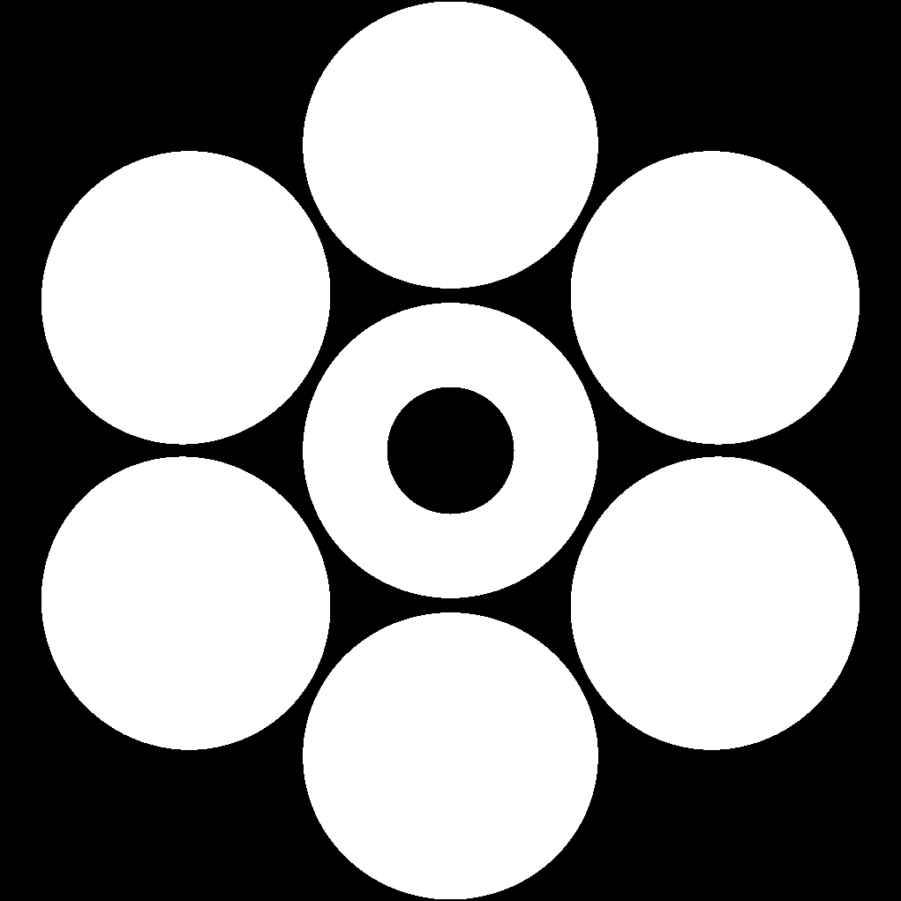

# Simulated globular cluster

Globular cluster star angular distribution

 
 

J band star magnitude distribution

 

## Natural Seeing

Parameters:
 * pixel scale: 0.3arcsec
 * exposure: 1hr 
 * photon noise
 * GLAO seeing FWHM reduction: 20%

### Wide field: 1x1 arcmin

 * V band (seeing/GLAO):

 
  

 * J band (seeing/GLAO)

 
  
 
### Narrow field: 20x20 arcsec

 * V band (seeing/GLAO):

 
  

 * J band (seeing/GLAO):

 
  

## High angular resolution

Telescopes:

| HST | JWST | GMT |
|:---:|:----:|:---:|
||||

Parameters
 * J band
 * pixel scale: Nyquist (λ/2D)
 * exposure:
   * HST : 4hr,
   * JWST: 45mn
   * GMT : 15mn
 * photon noise
 * NGAO strehl ratio: 80%
 * LGS asterism diameter: 60arcsec
 * LTAO strehl ratio: 50%

  ### HST
   

  ### JWST
   

  ### GMT NGAO
   

  ### GMT LTAO
   