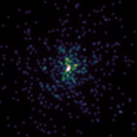

# Diffraction limited

```rust
cargo run --release --example diffraction-limited
```
Compares K band diffraction limited images of the HST, JWST and GMT for a globular-cluster-like distribution of stars.



