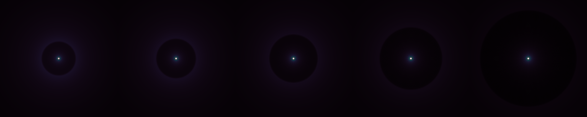

# Natural Guide Star Adaptive Optics

```rust
cargo run --release --example ngao
```
Compares NGAO images.
From left to right, the images are NGAO corrected by step of 10% of Strehl ratio increase starting with 50% Strehl for the leftmost image.


