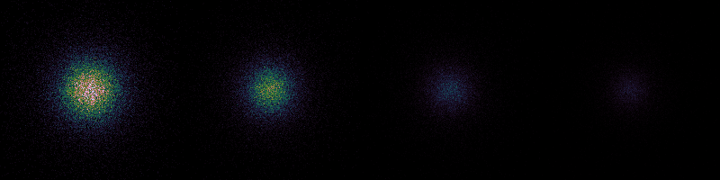

# Seeing limited sensitivity

```rust
cargo run --release --example seeing-limited_sensitivity
```
Compares seeing limited images of the Giant Magellan Telescope at J,J,H and K bands for magnitude 30 and a 5 hours exposure.



