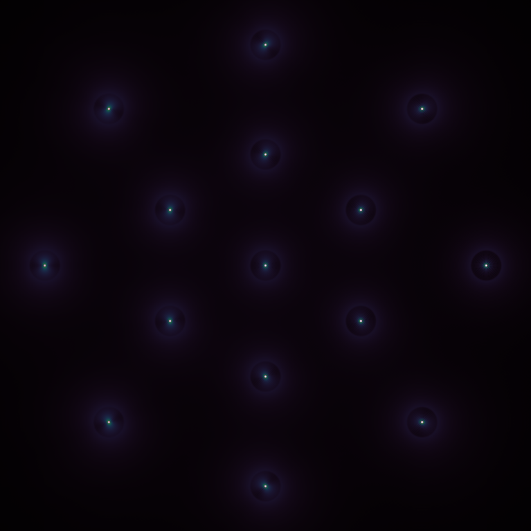

# Natural Guide Star Adaptive Optics (Wide Field)

```rust
cargo run --release --example wide-field_ngao
```
A 12arcsec x 12arcsec (Nyquist sampled) NGAO image in J band with a Strehl ratio of 80% on the guide star (rightmost centered star).

